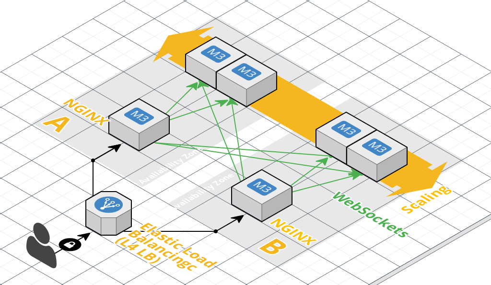
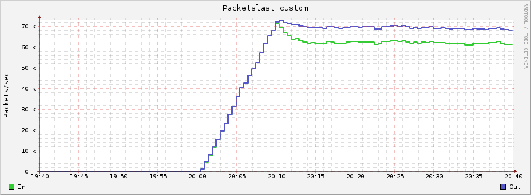
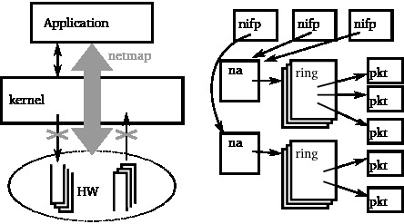

class: center, middle
name: inverse
layout: true
class: center, middle
---
## インフラエンジニアにとっての Rust
## -Rust for Infra Engineers-
.center[[@kizkoh](https://twitter.com/kizkoh/)]
.center[Kazuki OHNO (KLab inc.)]

---
layout: false
## Introduction
.center[]

.center[@kizkoh]
.center[KLab inc. Roppongi]

.center[AWS Infra Engineer]
.center[Go, Bash Engineer]

.center[((スクールアイドルに飯を食わせて養ってもらっている))]

???
普段、ゲームインフラや社内システムの Web サーバを運用してます
最近は景気がよくないので他案件のお手伝いとして go を書いたり、 AWS の新サービス、 GCP の検証をしたりと研究開発的なことをやってます
今回のはなしも業務ではないけど、個人的に挑戦している研究開発的なお話です

---
## Motivation
### インフラエンジニアとしてのおしごと
- Server Reliability  
  ...
- Monitoring  
  ...

- Network Performance

  - Packet filtering

  - PPS performance
  
  - SYN flood attack

???
案件を運用しているといろんなトラブルがある
インフラエンジニアはこれをできるだけ防止しないといけない

---
## Motivation
- 最近の事例(Packet filtering & PPS performance)
  1. WebSockets を ELB で nginx のロードバランシング  
  1. nginx でバックエンドサーバにルーティング
	 .center[]  

.center[**運用時最大の負荷で .red.bold[22000] 常時接続**]
---
## Motivation
- PPS がオーバーヘッド(120 Kpps @ m3.large)
.center[]  

- CPU 使用率も不安
```sh
[admin@front004]~$ top
KiB Mem:   7650564 total,  7080328 used,   570236 free,   282048 buffers
KiB Swap:  4200992 total,        0 used,  4200992 free,  3989428 cached

  PID USER      PR  NI  VIRT  RES  SHR S  %CPU %MEM    TIME+  COMMAND
28504 tcpeek    20   0 36480 4120 3096 R  54.2  0.1 691:47.90 tcpeek
27972 www-data  20   0  107m  74m 1128 R  37.6  1.0   9:18.54 nginx
27973 www-data  20   0  107m  74m 1128 S  37.6  1.0   9:20.30 nginx
```

???
パケットが多すぎるため、負荷が高い
PPS は 60Kpps で頭打ち
tcpeek は TCP の再送を検知するプログラム
古いバージョンの libpcap を使っているときはパケットを取りこぼすときがあった
それほど大量のパケットが流れているので tcpdump するときには取りこぼし必須な状況になっている
ちなみに現状は数の暴力で殴っている

---
## Solution
### お金をかけない解決方法

- Kernel を飛び超える??
  - userspace network stack(libOS)

  - netmap

  - intel dpdk

  - solarflare

.center[]  
???
Linux のネットワークスタックが複雑なので飛び超えたい
たとえば netfilter や最近だと network namespace とか
いずれの解決もアプリケーションとデバイスの間にカーネルが入ることがない

---
layout: true
class: center, middle
---
## それ Rust なら簡単にできるかもよ!

---
layout: false

## Rust
- システムプログラミング言語
  - オブジェクトの所有権付与による競合アクセス防止、パフォーマンス向上

  - C 互換のライブラリ作成
  
- cargo による柔軟なパッケージ管理

※一昨日 Rust-1.11 がリリースされました  
https://blog.rust-lang.org/2016/08/18/Rust-1.11.html

## libpnet
ユーザスペースで L2 - L4 を設計するための Crate

Rust で実装されているネットワークスタックなので、 C より安全(ほんまか?)

プロトコルスタックが用意されている & 独自のプロトコルスタックが作れる!!

**頑張れば nginx, tcpeek を置き替えられそう!?**

???
個人的に思うことだけど cargo はかなり優秀なパッケージマネージャ
Go の package 設計や vendoring の問題みたいなことは発生しない

Rust のパッケージのことを Crate と言います
libpnet はユーザが手をつけたくない部分を十分にやってくれる

???
- tcp
  - server
iperf3 -s 127.0.0.1 -p 5201 2>&1
  - client
iperf3 -c 127.0.0.1 -i 60 -t 600 -V -p 5201 -P 1 -M 88 -N -Z 2>&1
tcpdump -i lo -n -A dst port 5201

cd /examples

tcpdump -i vethe703739

./pkt-gen -i vethe703739 -f rx -w 4
./pkt-gen -i eth0 -f tx -w 5 -l 60 -S 02:42:ac:11:00:02 -D 02:42:6f:97:38:5e -s 172.17.0.2 -d 172.18.0.1 -n 300000000
./pkt-gen -i veth91bb9a6 -f tx -w 5 -l 60 -S c6:15:f5:ff:10:f3 -D c6:15:f5:ff:10:f3 -s 172.18.0.1 -d 172.18.0.1 -n 300000000

[94676.280224] 872.481041 [ 117] veth_netmap_txsync        Warning: peer veth is not in netmap mode, dropping
[94676.468730] 872.669539 [ 117] veth_netmap_txsync        Warning: peer veth is not in netmap mode, dropping
[94771.516689] 967.714285 [ 117] veth_netmap_txsync        Warning: peer veth is not in netmap mode, dropping

---
## Implementation
- Rust と libpnet を使ってパケットキャプチャを作る

- libpnet の example にパケットキャプチャが公開されている  
  <br />
  https://github.com/libpnet/libpnet/blob/master/examples/packetdump.rs

- 今回はそのまま利用

---
## Implementation
- OS のネットワークスタックを使った一般的なパケットキャプチャの実装
  https://github.com/kizkoh/rust/tree/master/pnet-study-general
  
```sh
# ./target/debug/pnet-study-general lo
[lo]: TCP Packet: 127.0.0.1:52472 > 127.0.0.1:6600; length: 39
[lo]: TCP Packet: 127.0.0.1:6600 > 127.0.0.1:52472; length: 269
[lo]: TCP Packet: 127.0.0.1:52472 > 127.0.0.1:6600; length: 32
[lo]: TCP Packet: 127.0.0.1:52472 > 127.0.0.1:6600; length: 44
[lo]: TCP Packet: 127.0.0.1:6600 > 127.0.0.1:52472; length: 329
[lo]: TCP Packet: 127.0.0.1:52472 > 127.0.0.1:6600; length: 32
```

- strace してみるとシステムコールの呼び出しコストは tcpdump とほぼ同じ

- 少しシステムコールが違うだけ

```sh
recvfrom(4, "\0\0\0\0\0\0\0\0\0\0\0\0\10\0E\0\1]aQ@\0@\6\332G\177\0\0\1\177\0"..., 4096, 0, {sa_family=AF_PACKET, proto=0x800, if1, pkttype=PACKET_HOST, addr(6)={772, 000000000000}, [18]) = 363
write(1, "[lo]: TCP Packet: 127.0.0.1:6600"..., 64[lo]: TCP Packet: 127.0.0.1:6600 > 127.0.0.1:52472; length: 329
) = 64
pselect6(5, [4], NULL, NULL, NULL, {NULL, 8}^CProcess 17288 detached
```

---
## Implementation
### 今回の目的
- とりこぼさない正確なパケットキャプチャ
 
- CPU が低い、動作は早いパケットキャプチャ

kernel をバイパスするため、 netmap を使う

---
## Implementation
### 呪文
- netmap のセットアップ

```sh
$ git clone git@github.com:luigirizzo/netmap.git
$ cd ./netmap/LINUX
$ su
# ./configure --kernel-sources=/usr/src/linux-4.4.6-gentoo-netmap/ --kernel-dir=/usr/src/linux-4.4.6-gentoo-netmap/
kernel directory            /usr/src/linux-4.4.6-gentoo-netmap
linux version               40406  [4.4.6]
module file                 netmap.ko
subsystems                  generic monitor pipe vale
kernel sources              /usr/src/linux-4.4.6-gentoo-netmap
requested drivers           veth.c
# cd /usr/src/linux-4.4.6-gentoo-netmap/
# make KSRC=/usr/src/linux-4.4.6-gentoo-netmap/
# make -j4 && make modules_install && make install

# cd ./sys/net
# ln -sfnv $(readlink -f ./sys/net/netmap.h) /usr/include/net/netmap.h
# ln -sfnv $(readlink -f ./sys/net/netmap_user.h) /usr/include/net/netmap_user.h
```
今回ドライバを持ち合わせていないので veth で netmap を利用してみた

???
一度やったことある人はいるかもしれないけど netmap の準備は大変

---
## Implementation
- netmap を使ったパケットキャプチャ
  https://github.com/kizkoh/rust/tree/master/pnet-study-netmap

  - 先程のコードの Cargo.toml に `features` を指定する
  - libpnet が netmap を experimental にサポートしてくれている  
    (libpnet の datalink/netmap.rs がビルドできなかったのでいじった)

``` sh
[dependencies.pnet]
git = "https://github.com/kizkoh/libpnet"
features = ["netmap"]
```
  - netmap とのやり取りは https://github.com/libpnet/netmap_sys  
    実装は C のバインディング

いざ、キャプチャ!!
1. docker container をキックして veth を作成
2. netmap.ko をロード
``` sh
[  185.698449] 935.002274 [3301] netmap_init               run mknod /dev/netmap c 10 54 # error 0]
[  185.698498] netmap: loaded module
[  185.699831]  (null): netmap queues/slots: TX 1/1024, RX 1/1024
```

---
## Implementation
```sh
# ip link
5: docker_gwbridge: <NO-CARRIER,BROADCAST,MULTICAST,UP> mtu 1500 qdisc noqueue state DOWN mode DEFAULT group default 
    link/ether 02:42:17:34:05:ef brd ff:ff:ff:ff:ff:ff
9: veth983aeb9@if8: <BROADCAST,MULTICAST,UP,LOWER_UP> mtu 1500 qdisc noqueue master docker0 state UP mode DEFAULT group default 
    link/ether 0a:2f:dc:b4:a6:5f brd ff:ff:ff:ff:ff:ff link-netnsid 0
```

```sh
# strace ./target/debug/pnet-study-netmap vethd450358
read(4, "2048\n", 32)                   = 5
read(4, "", 27)                         = 0
close(4)                                = 0
ppoll([{fd=3, events=POLLIN}], 1, NULL, NULL, 8
```

- なぜか ppoll で止まる
- \# なんで read できないの??(´・ω・｀)

---
## Implementation
- 発生条件が分からないけどごく一部キャプチャできる
```
[vethe703739]: UDP Packet: 172.17.0.2:0 > 172.18.0.1:0; length: 26
[vethe703739]: UDP Packet: 172.17.0.2:0 > 172.18.0.1:0; length: 26
[vethe703739]: UDP Packet: 172.17.0.2:0 > 172.18.0.1:0; length: 26
[vethe703739]: UDP Packet: 172.17.0.2:0 > 172.18.0.1:0; length: 26
[vethe703739]: UDP Packet: 172.17.0.2:0 > 172.18.0.1:0; length: 26
[vethe703739]: UDP Packet: 172.17.0.2:0 > 172.18.0.1:0; length: 26
[vethe703739]: UDP Packet: 172.17.0.2:0 > 172.18.0.1:0; length: 26
thread 'main' panicked at 'called `Option::unwrap()` on a `None` value', ../src/libcore/option.rs:326
stack backtrace:
   1:     0x557a99681c9d - std::sys::backtrace::tracing::imp::write::h29f5fdb9fc0a7395
   2:     0x557a99684851 - std::panicking::default_hook::_{{closure}}::h17d8437f66223ab1
```
- そしてクラッシュ

???
Memo

---
## Implement
- 原因を追求するもわからず
  - https://github.com/libpnet/netmap_sys/  
    まともに検証したい

- 期待していたもの
  - libpnet と netmap で tcpdump 置き換え

- 現実
  - libpnet の netmap サポートが不安定
  - netmap がうまく扱えない(?)  

---
## Conclusion
- 概要
  - インフラエンジニアが Rust を学ぶモチベーションをあげたかった

  - Rust でパケットキャプチャは実装できるし、最新の技術は使っていける
  
- つらいところ、課題
  - Rust, libpnet の情報がほとんどない

  - キャッチアップは基本的に Github, Reddit	

  - netmap 対応 NIC がなくて、どこが悪いか検証が難しい

  - cloud, IaaS 等で netmap 対応がない  
    Xen でできないことはないっぽい  
    https://github.com/cnplab/xennet 
	
  - rust-dpdk もあるので rust と libpnet の今後に期待
  
  
???
- Memo
http://plhk.ru/trash/netmap-20160427.pdf
https://github.com/cnplab/xennet

