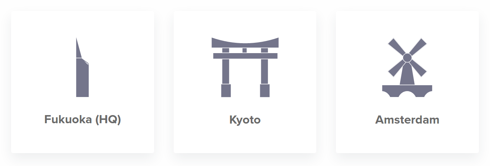
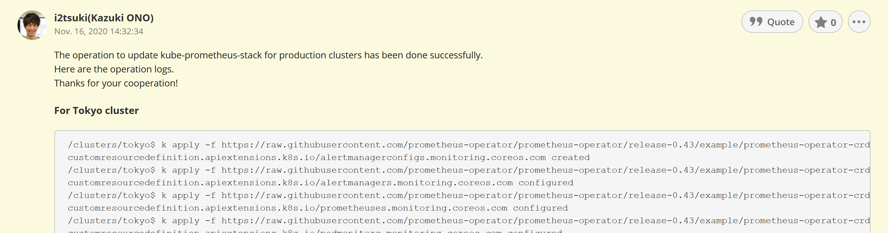

class: center, middle
layout: true
---
# それぞれのタイムゾーン 言語を持つ Platform チームの働き方
.center[[大野一樹](https://twitter.com/kizkoh)]

.center[2020-12-05]
.center[[NuCon 2020](https://rust.connpass.com/event/41467/)]

---
class: inverse
# なんの話をするの??

---
class: inverse
# Platform チームの紹介

---
layout: false
## (Backlog) Platform チームの紹介
#### 自己紹介
- #### Backlog Platform チーム所属
- #### 2020年6月入社

#### いつからあるチーム?
- #### 今年の 8 月から日本とフランスのエンジニアから作られたチーム
- #### それまでは別の名前のチームだった

---
## (Backlog) Platform チームの紹介
#### なにをやっているチーム?
- #### AWS EKS を使って Backlog のコンテナプラットフォームをつくる
- #### サービスアーキテクチャの Microservices 化を支援する
- #### Prometheus を使って既存の EC2 上アプリケーションのモニタリングを良くする
.center[]

---
layout: false
## (Backlog) Platform チームの紹介
#### メンバー構成
- #### 3 人 + α (別タスクを担当しているメンバもいるため)

#### オフィスは閉鎖中 & ロケーションはバラバラ
- #### Fukuoka, Kyoto, Paris

.center[]

---
layout: false
## Platform チームの活動
#### 言語
- #### 英語

#### 働いている時間
- #### 10:00 - 19:00 (JST); 1:00 - 10:00 (UTC)
- #### 9:00 - 18:00 (CET); 8:00 - 17:00 (UTC)

#### 定時ミーティング
- #### 進捗共有や相談する時間を取る (例: 次のタスクの相談や対応の相談)
- #### 日本時間の午後 5 時 - 6 時に開催している (パリのタイムゾーンは CET : GMT+1)

---
layout: false
## Platform チームの活動
#### レトロスペクティブ
- #### 週に 1 回チームの KPT を振り返る
.center[]

---
class: center, middle, inverse
# チーム内のコミュニケーション問題

---
layout: false
## チーム内のコミュニケーション問題
#### タイムゾーンの違い
- #### JST (GMT+9) / CET (GMT+1): 最大 8 時間の時差がある、夏時間だと 7 時間になる
- #### 会社として午後 10 時 - 午前 5 時までは残業扱いになる

#### 言語の違い
- #### 基本的に英語でのコミュニケーション
- #### 英語でのコミュニケーションに慣れていないメンバもいる
- #### リモート越しなので音声が聞き取りづらいときがある

---
class: center, middle, inverse
## どうやってチームワークをカバーしているか?

---
layout: false
## タイムゾーンの問題の解決
#### 基本的にテキストでの非同期コミュニケーション
- #### Issue や PR でのコミュニケーションはもともと非同期コミュニケーション
- #### ディスカッションしたいときはミーティング前後 (日本時間 17 時前後) を狙う
- #### 他のサービスの Kubernetes クラスタ運用について聞くチャンネルがある
  #### 日本、ヨーロッパ(それぞれのタイムゾーン)のオフィスのメンバに質問して解決できる環境がある

---
layout: false
## 言語の違いの解決
- #### 音声が聞き取りづらいときはテキストでやり取りをする
  #### Google Docs や Cacoo を使ってコミュニケーションを取る
- #### 参照するドキュメントはいずれにしても英語

---
layout: false
## オペレーション・モブプログラミング
#### オペレーション
- #### オペレーションのログは Backlog の Issue に残す
- #### 不安な場合やクリティカルなオペレーションはミーティング後にペアオペレーションする

#### モブプログラミング
- #### モブプログラミングや Cacoo でアーキテクチャ図を共有してその場でレビューしたりする

---
class: center, middle, inverse
## コミュニケーションのためにやっていること

---
## その他のコミュニケーションのためにやっていること
#### 話題作りのための私生活の変化
- #### .red[海外ニュース]を見るようになった!

#### 英語学習福利厚生の紹介
- #### ヌーラボには.red[英語学習の福利厚生]がある!
.center[]

---
class: center, middle, inverse

# Thank you for watching!!
